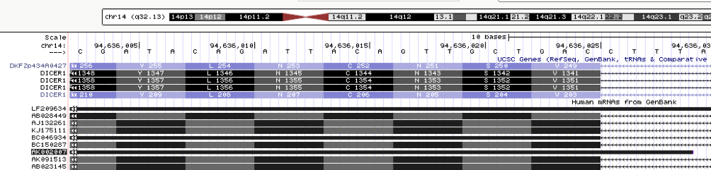
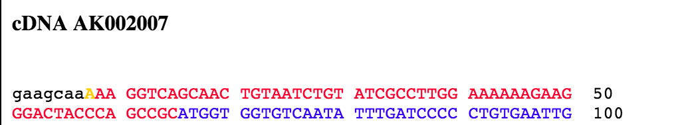
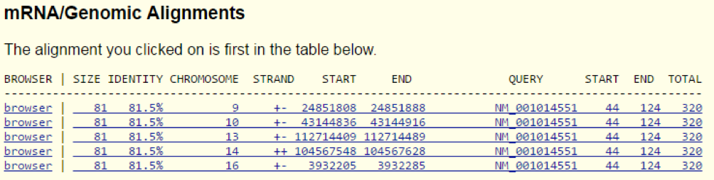
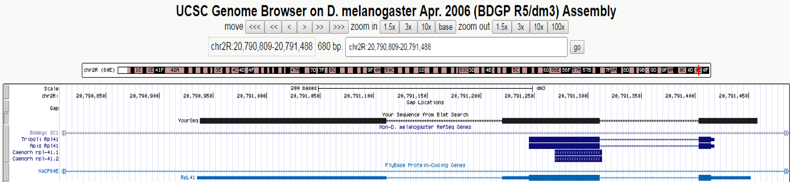
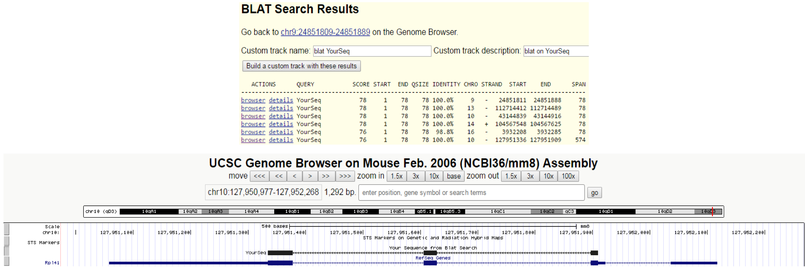

```{r setup, include=FALSE}
knitr::opts_chunk$set(echo = TRUE)
```
## Part 1
### A: What are the first five genomic nucleotides from the first exon of the transcript AK002007?


Examination of the first exon in AK002007 reveals the first five nucleotides to be: AAAGG

### B: Look at the raw mRNA sequence of AK002007, from the database it actually comes from. What are the first five nucleotides? 


Thus, the first five nucleotides in the raw mRNA sequence of AK002007 is: GAAGC

### C: How do you explain the discrepancy (maximum 5 lines)?
First seven nucleotides on the mRNA sequence are not mapped to the genome. 
The raw sequence is cDNA that then is mapped to the genome to create the mRNA track. 
The discrepancy could be explained by the fact that cDNA is used during the gene sequencing in which a lot of other factors are also involved. These include adaptors, primers and linkers which are attached to the sequence during the process. Thus, the ends of the sequence are error-prone and therefore need to be trimmed.

## Part 2
### A: What is the genome coverage (% of base pair covered at each chromosome) for ERB and ERA sites?
In order to compute the genome coverage for ERb and ERa sites we firstly need to sort them. This is done with the following commands:
```{bash, echo=TRUE}
sort -k 1,1 -k 2,2n ERb_hg18.bed > sorted_ERb_hg18.bed
sort -k 1,1 -k 2,2n ERa_hg18.bed > sorted_ERa_hg18.bed
```

The genome coverage is computed using the genomecov command from the BEDtools library.
The -max 1 option in the command means that all chromosomes that have 1 or more ERa and ERb sites covering will be counted as one.
```{bash, eval=FALSE, echo=TRUE}
nice bedtools genomecov -i ERa_hg18.bed -g hg18_chrom_sizes.txt -max 1
```

```{bash, eval=FALSE, echo=TRUE}
nice bedtools genomecov -i ERb_hg18.bed -g hg18_chrom_sizes.txt -max 1
```

The output of the genomecov for the ERa sites and ERb sites, where the last column shows genome coverage for each chromosomes: 
ERa genome coverage
```{r, echo=TRUE}
ERa_coverage <- read.table("genomecoverage_ERa.bed", header = F)
head(ERa_coverage, n=3)
```

ERb genome coverage
```{r, echo=TRUE}
ERb_coverage <- read.table("genomecoverage_ERb.bed", header = F)
head(ERb_coverage, n=3)
```

#### Plot the fractions for all chromosomes as a single barplot in R.
The plot shows the percentage of genome coverage for ERa and ERb sites. 
The genome rows have been deleted from the genomecoverage_ERa.bed and genomecoverage_ERb.bed files because this data is not relevant in this analysis. 

```{r, echo=TRUE}
ERa_coverage <- read.table("genomecoverage_ERa.bed", header = F)
ERb_coverage <- read.table("genomecoverage_ERb.bed", header = F)

coverage_a <- ERa_coverage[ERa_coverage$V5==1, c(1:5)]
coverage_a$V2=1; coverage_a$V5=0
coverage_b <- ERb_coverage[ERb_coverage$V5==1, c(1:5)]
coverage_b$V2=1; coverage_b$V5=0

new_coverage_ERa <- rbind(ERa_coverage, coverage_a)
new_coverage_ERa_sorted <- new_coverage_ERa[order(new_coverage_ERa$V1),]
new_coverage_ERb <- rbind(ERb_coverage, coverage_b)
new_coverage_ERb_sorted <- new_coverage_ERb[order(new_coverage_ERb$V1),]

chromosome_number_a <- new_coverage_ERa_sorted$V1[new_coverage_ERa_sorted$V2==1] # labels
chromosome_number_b <- new_coverage_ERb_sorted$V1[new_coverage_ERb_sorted$V2==1] #labels

barplot(new_coverage_ERa_sorted$V5[new_coverage_ERa_sorted$V2==1]*100, 
         col='red', density = NULL, las=3, names.arg = chromosome_number_a)
barplot(new_coverage_ERb_sorted$V5[new_coverage_ERb_sorted$V2==1]*100, 
        col='blue', add = T, density = 20, ylab='percentage of coverage %', 
        xlab = 'chromosomes number')
title(main='Genome coverage for ERa and ERb sites with one or more overlaps')
legend('topright', fill=c('red', 'blue'), legend=c('ERa','ERb'),
       density=c(NA,30))
```

The plot shows the percentage of genome coverage of the chromosomes with 1 or more bindingsites.
ERa and ERb have bindingsites on the same chromosomes, though ERa covers a larger percentage of each chromosome.However, in this experiment ERa and ERb only bind to six of the chromosomes. Estrogen receptors are nuclear receptors that are likely to regulate many genes throughout the genome. It is possible that they in fact bind other chromosomes as well, but we did not see it in this dataset.
Based on our data, it is possible that ERa and ERb share bindingsites and thus serve (some of) the same functions.

### B: How many ERa sites do/do not overlap ERb sites, and vice versa?
```{bash, eval = FALSE, echo=TRUE}
bedtools intersect -a sorted_ERa.bed -b sorted_ERb.bed -c > a_overlap_b.bed
bedtools intersect -a sorted_ERb.bed -b sorted_ERa.bed -c > b_overlap_a.bed
```

```{r, echo=TRUE, message=FALSE, warning=FALSE}
a_overlap_b <- read.table("a_overlap_b.bed", header=F)
cross_area_ab <- sum(a_overlap_b$V4)
b_overlap_a <- read.table("b_overlap_a.bed", header=F)
cross_area_ba <- sum(b_overlap_a$V4)

# Venn diagram summarizing the results.
ERa_data<- read.table("ERa_hg18.bed", row.names = NULL)
ERb_data<- read.table("ERb_hg18.bed", row.names = NULL)
area_ERa<-length(ERa_data$track)
area_ERb <- length(ERb_data$track)
library(VennDiagram)
draw.pairwise.venn(area_ERa, area_ERb, 
    cross.area=cross_area_ba, c("ERa","ERb"), fill=c("red","blue"))
```
The number of ERa sites overlapping ERb sites is 345 and it is the same as the number of ERb sites overlapping ERa sites. 

## Part 3
BLAT algorithm has been applied to the mRNA sequence of the fly gene found in mouse genome and that of D. melanogaster (Feb. 2006 assembly/mm8 was chosen to compare these two).
The fly gene looks completely odd when mapped to the mouse genome, evident by the fact that the gene only consists of one big exon and does not have either 5' or 3' UTRs, which all are normally present. In addition to that, turning on CpG island tracks in UCSC browser shows that there is no region of CpG islands present in the studied gene region - although CpG islands are not required for promoter regions, the absence seems suspicious. 
Running BLAT on the mouse sequence from the new-gene region and the mouse genome, gives rise to several perfect hits, and many hits with a relative good score - suggesting the sequence is common in the mouse genome. A particular hit spanning 577 base pairs with a 100% identity maps to a gene called Rpl41 on chromosome 10 in the mouse genome. 
This can be explained by Rpl14 being greatly conserved throughout species, and that this particular sequence at some point has been replicated and inserted randomly in the genome. Thus, the postulated 'new gene' is actually a pseudogene (segment of DNA that is related to a real gene). 






