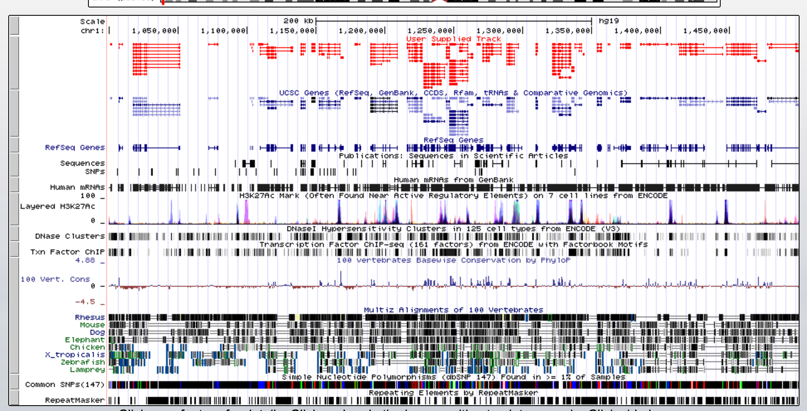

```{r setup, include=FALSE}
knitr::opts_chunk$set(echo = TRUE)
```
## Part 1
### Question 1: Calculating the mean signal of these two genes across the patient groups (HIV and non-HIV) shows that IRX3 always has higher signals than RXR. Can we then conclude that IRX3 is higher expressed in all these samples?

When taking these data into consideration, it is not possible for us to conclude that IRX3 is higher expressed in all samples. As we discussed in the genomic browser exercise earlier this course, IRX3 consists of extremely large CpG islands, and the increase in expression could be explained by the fact that the probe is more prone to bind to this sequence ??? making the comparison of expression levels invalid. 

### Question 2: Do a suitable statistical test for each row to find the differentially expressed genes (show the R code only ??? we will use the result in the next few questions)

```{r, echo=TRUE}
rm(list=ls())
hiv<-read.table("normalized_data.txt", header=F)
colnames(hiv)<-c("HIV_1","HIV_2","HIV_3","HIV_4","HIV_5",
                 "Healthy_1","Healthy_2","Healthy_3","Healthy_4","Healthy_5")
```

To begin, data is checked to choose the most appropriate statistical test. In this case, data of gene expressions exhibit normality (not shown). Hence, we choose to perform a student t-test. Our hypotheses are:
H0:  The difference of the mean in gene expression in both HIV and healthy patients is the same
HA:  The difference of the mean in gene expression in both HIV and healthy patients is not the same
```{r, echo=TRUE}
p_val<-sapply(1: nrow(hiv), function(x) t.test(hiv[x, 1:5], hiv[x, 6:10])$p.value)

```
### Question 3: How many false positives would you expect for this experiment if you use a threshold of 0.05? How many genes do you actually get with a p-value less than 0.05? 

We would expect the following number of false positives: 
```{r, echo=TRUE}
length(p_val)*0.05
```

What we actually got from our test:
```{r, echo=TRUE}
sum(p_val<0.05)
```

Thus, we get a difference of 797 FPs when comparing expected versus real.

### Question 4: The function p.adjust(p-values) can be used to correct for multiple testing. How many genes do you get with a p-value <0.2 when you use the Bonferroni correction? How many do you get with a FDR (Use the BH method) than 0.2. How many of these genes(FDR<0.2) would you expect to be false positives?
By using the p.adjust function in R, we obtain the following adjusted p-values:
```{r, echo=TRUE}
p_val_bonf<-p.adjust(p_val,method="bonferroni")
numb_bonf<-sum(p_val_bonf<0.2)
numb_bonf
p_val_FDR<-p.adjust(p_val,method="BH")
numb_FDR<-sum(p_val_FDR<0.2)
numb_FDR
```

Thus, 0 and 12 genes have a p-value below 0.2 with Bonferroni and FDR adjustment, respectively. 
As regards to the fdr adjustment, we would expect 2 out of the 12 genes to be false positives. 

### Question 5: She also want to see how big the changes between the conditions are. So calculate the log2 foldchange for each gene. Report the fold changes for the genes with a FDR<0.2. Are there most up (Up in HIV) or down regulated genes in this subset? Comment on the size of the log2FCs
```{r, echo=TRUE}
#calculating the fold-change by apply function:
mean_hiv<-sapply(1:nrow(hiv), function(x) mean(as.numeric(hiv[x,1:5])))
mean_con<-sapply(1:nrow(hiv), function(x) mean(as.numeric(hiv[x,6:10])))
foldchange_hiv<-log2(mean_hiv)-log2(mean_con)
foldchange_hiv[p_val_FDR<0.2]
```

Based on the log2-value: all the 12 genes are > 0.2 and hence upregulated in HIV. 

## Part 2
### Question 2: For each condition calculate the average number of lines in the 3 'assembled transcripts'
The lines for transcripts WTD_1, WTD_2, WTD_3 are:  991, 1014, 991 and the average for the WildType condition is: (991 + 1014 + 991)/3 =~ 998

The lines for transcripts KD_1, KD_2, KD_3 are: 1004, 1015, 1064 and the average for the KnockDown condition is: (1004 + 1015 + 1064)/3 =~ 1027

### Question 3: How many lines does the combined GTF file have? How does that compare to the individual transcriptomes? What does this suggests?

Merging the 'assembled transcripts' from the cufflinks and using the imported UCSC genes as Reference Annotation, the GTF file has 1207 lines. 
[comment]: <add something here>
The combined transcriptome has been uploaded on the genome browser UCSC.



### Question 4: Use 'Cuffdiff' to make the differential expression analysis between the two conditions (WT and KD). Why would be want to use bias correction?

### Question 5: Specify what CuffDiff have tested in the 'Splicing differential expression testing'
The CuffDiff of the 'Splicing differential expression testing' results in a file 'listing, for each primary transcript, the amount of isoform switching detected among its isoforms. Only primary transcripts from which two or more isoforms are spliced are listed in this file'. [reference: cuffdiff documentation](http://cole-trapnell-lab.github.io/cufflinks/cuffdiff/#differential-splicing-tests---splicingdiff)

In our scenario it is shown how much differential splicing exists between isoforms of Wild Type and Knock Down. 

## Part 3
### Question 1: Read the supplied 3 CuffDiff result files and change the column name ???test_id??? to ??? transcript_id???
```{r, echo=TRUE}
gene_diff_exp <- read.table("cuffdiff_gene_differential_expression.txt", header = T)
colnames(gene_diff_exp)[which(names(gene_diff_exp) == "test_id")] <- "transcript_id"

transcript_diff_exp <- read.table("cuffdiff_transcript_differential_expression.txt", header = T)
colnames(transcript_diff_exp)[which(names(transcript_diff_exp) == "test_id")] <- "transcript_id"

splicing_diff_exp <- read.table("cuffdiff_splicing_differential_expression.txt", header = T)
colnames(splicing_diff_exp)[which(names(splicing_diff_exp) == "test_id")] <- "transcript_id"

```

