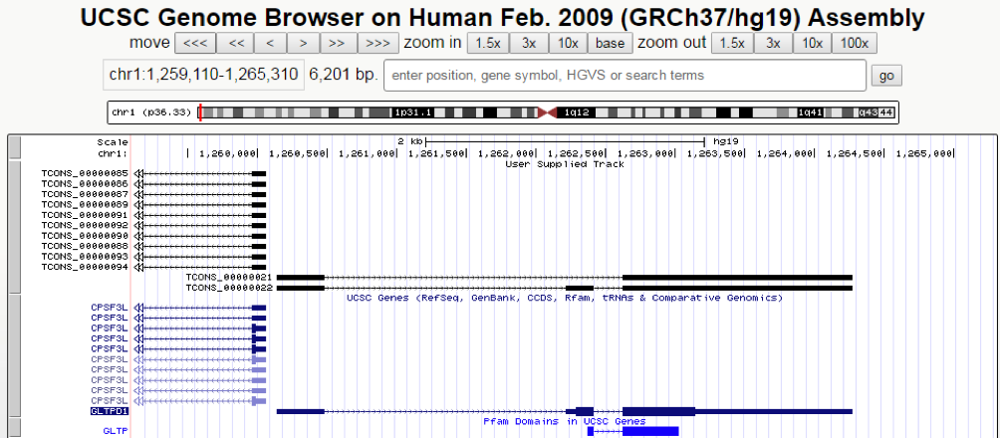

```{r setup, include=FALSE}
knitr::opts_chunk$set(echo = TRUE)
```
## Part 1
### Question 1: Calculating the mean signal of these two genes across the patient groups (HIV and non-HIV) shows that IRX3 always has higher signals than RXR. Can we then conclude that IRX3 is higher expressed in all these samples?

When taking these data into consideration, it is not possible for us to conclude that IRX3 is higher expressed in all samples. There are several things to consider before making such a conlusion. Some probes on the microarray may have higher affinity than others, so it is not meaningful to compare the signals for two genes on the same microarray. For example, as we discussed in the genomic browser exercise earlier this course, IRX3 consists of extremely large CpG islands and the high signal could be explained by the fact that the probe is more prone to bind to this sequence. 
What we can do is to compare the signal for the same gene under two different conditions, i.e. on two different plates, because the probes are the same. However, there are many non-biological factors that can explain a difference in signal between two microarrays, e.g. the quality of the RNA. Such factors should affect all signals on the plate equally, and it is therefore possible to normalize for them. Meaning, imcluding genes that is known not to change their expression pattern in the different conditions in order to identify genes with altered expression profiles. 
So what is important to note about microarray analysis is that it reveals only relative (not quantitative) changes in gene expression. Lastly it should be mentioned that several replicates are required to draw any conclusions. 

### Question 2: Do a suitable statistical test for each row to find the differentially expressed genes (show the R code only we will use the result in the next few questions)

```{r, echo=TRUE}
rm(list=ls())
hiv <- read.table("normalized_data.txt", header=F)
colnames(hiv) <- c("HIV_1","HIV_2","HIV_3","HIV_4","HIV_5",
                 "Healthy_1","Healthy_2","Healthy_3","Healthy_4","Healthy_5")
```

To begin, data is checked to choose the most appropriate statistical test. In this case, data of gene expressions exhibit normality (not shown). Hence, we choose to perform a student t-test. Our hypotheses are:
H0:  The difference of the mean in gene expression in both HIV and healthy patients is the same
HA:  The difference of the mean in gene expression in both HIV and healthy patients is not the same
```{r, echo=TRUE}
p_val <- sapply(1: nrow(hiv), function(x) t.test(hiv[x, 1:5], hiv[x, 6:10])$p.value)

```

### Question 3: How many false positives would you expect for this experiment if you use a threshold of 0.05? How many genes do you actually get with a p-value less than 0.05? 
When setting the significant threshold to 0.05, we would expect circa 0.05*100=5% false positives (1114 genes), which indicates genes exhibiting a significant expression pattern but truely doesn't (type 1 error).
We would expect the following number of false positives: 
```{r, echo=TRUE}
length(p_val)*0.05
```

Whereas, what resulted from our test:
```{r, echo=TRUE}
sum(p_val<0.05)
```

### Question 4: The function p.adjust(p-values) can be used to correct for multiple testing. How many genes do you get with a p-value <0.2 when you use the Bonferroni correction? How many do you get with a FDR (Use the BH method) than 0.2. How many of these genes(FDR<0.2) would you expect to be false positives?

By using the p.adjust function in R, we obtain the following adjusted p-values:
```{r, echo=TRUE}
p_val_bonf <- p.adjust(p_val,method="bonferroni")
numb_bonf <- sum(p_val_bonf<0.2)
numb_bonf
p_val_FDR <- p.adjust(p_val,method="BH")
numb_FDR <- sum(p_val_FDR<0.2)
numb_FDR
```

Thus, 0 and 12 genes have a p-value below 0.2 with Bonferroni and FDR adjustment, respectively. 
As regards to the fdr adjustment, we would expect 12x0.2 =~ 2 out of the 12 genes to be false positives. 

### Question 5: She also want to see how big the changes between the conditions are. So calculate the log2 foldchange for each gene. Report the fold changes for the genes with a FDR<0.2. Are there most up (Up in HIV) or down regulated genes in this subset? Comment on the size of the log2FCs

```{r, echo=TRUE}
#calculating the fold-change by apply function:
mean_hiv <- sapply(1:nrow(hiv), function(x) mean(as.numeric(hiv[x,1:5])))
mean_con <- sapply(1:nrow(hiv), function(x) mean(as.numeric(hiv[x,6:10])))
foldchange_hiv <- log2(mean_hiv)-log2(mean_con)
fc_log2_values <- foldchange_hiv[p_val_FDR<0.2]
(2^fc_log2_values)*100

```

The log2-foldchange values are calculated in order to define the change in gene expression. Based on the definition of fold change (fold change = log2(mean(HIV)) - log2(mean(control)), a negative log2-score represents a reduced expression of a gene, values of log2 equals to 0 mean no change in expression for the different conditions and finally, a positive score indicates an upregulation. Thus, since all the 12 genes obtain a positive log2-score we conclude they're all upregulated in HIV. The fold change is shown above. The 12 genes exhibit an upregulation ranging from approximately 2.5% to 52%, meaning the change in expression isn't that extraordinary when comparing the two conditions. 

## Part 2
### Question 2: For each condition calculate the average number of lines in the 3 'assembled transcripts'

The lines for transcripts WTD_1, WTD_2, WTD_3 are:  991, 1014, 991 and the average for the WildType condition is: (991 + 1014 + 991)/3 =~ 998

The lines for transcripts KD_1, KD_2, KD_3 are: 1004, 1015, 1064 and the average for the KnockDown condition is: (1004 + 1015 + 1064)/3 =~ 1027

### Question 3: How many lines does the combined GTF file have? How does that compare to the individual transcriptomes? What does this suggests?

Merging the 'assembled transcripts' from the cufflinks and using the imported UCSC genes as Reference Annotation, the GTF file has 1207 lines. 
Cuffmerge gives rise to a GTF file containing 1207 lines. Cufflink gives an output in the form of a transcriptome for each replica in each conditions (in this case for WT and KD). We then use cuffmerge to create a common set of transcripts a combined transcriptome. Although most transcripts are shared between the individual transcriptomes, a minor pool of transcripts are only found in some of the sample which is why we see a difference in number of lines. Thus, a total number of 1207 reads are mapped to the shared transcriptome of both conditions. 
The combined transcriptome has been uploaded on the genome browser UCSC.


### Question 4: Use 'Cuffdiff' to make the differential expression analysis between the two conditions (WT and KD). Why would be want to use bias correction?

In RNA-sequencing, there is a positional bias towards fragments are preferentially located towards either the start or end of the transcripts. Based on this, it is appropriate to use the function ???bias correction??? in order to improve the expression analysis and for proper comparison of the samples analyzed.
[Reference: bias](https://genomebiology.biomedcentral.com/articles/10.1186/gb-2011-12-3-r22)

### Question 5: Specify what CuffDiff have tested in the 'Splicing differential expression testing'

A primary transcript is a a designated mRNA in a unprocessed state, meaning that it hasn't yet received a poly-A tail and still contains introns, which are about to be spliced out in order for one or more isoforms to be created. The CuffDiff of the 'Splicing differential expression testing' results in a file listing, for each primary transcript, the amount of isoform switching detected among its isoforms. Only primary transcripts from which two or more isoforms are spliced are listed in this file'.
[reference: cuffdiff documentation](http://cole-trapnell-lab.github.io/cufflinks/cuffdiff/#differential-splicing-tests---splicingdiff)

In our scenario it is shown how much differential splicing exists between isoforms of Wild Type and Knock Down. 

## Part 3
### Question 1, 2 & 3: Read the supplied 3 CuffDiff result files and change the column name 'test_id' to 'transcript_id'
```{r, echo=TRUE}
gene_diff_exp <- read.table("cuffdiff_gene_differential_expression.txt", 
                            header = T)
colnames(gene_diff_exp)[which(names(gene_diff_exp) == "test_id")] <- "transcript_id"

gene_diff_exp_subset <- subset(gene_diff_exp, 
  gene_diff_exp$value_1>0.0 | gene_diff_exp$value_2 > 0.0 )
gene_diff_exp_significant <- subset(gene_diff_exp, gene_diff_exp$significant =='yes')
nrow(gene_diff_exp_subset)
nrow(gene_diff_exp_significant)

transcript_diff_exp <- read.table("cuffdiff_transcript_differential_expression.txt", 
                                  header = T)
colnames(transcript_diff_exp)[which(
  names(transcript_diff_exp) == "test_id")] <- "transcript_id"

transcript_diff_exp_subset <- subset(transcript_diff_exp, 
  transcript_diff_exp$value_1>0.0 | transcript_diff_exp$value_2 > 0.0 )
transcript_diff_exp_significant <- 
  subset(transcript_diff_exp, transcript_diff_exp$significant =='yes')
nrow(transcript_diff_exp_subset) 
nrow(transcript_diff_exp_significant)

splicing_diff_exp <- read.table("cuffdiff_splicing_differential_expression.txt", 
                                header = T)
```

The number of genes expressed is 26 and the number of expressed transcripts is 98. The number of significantly differentially expressed genes is 12 and the number of significantly differentially expressed transcripts is 11.

### Question 4: How many rows does this new data.frame contain? How many columns?

```{r, echo=TRUE}
transcript_diff_sub2 <- transcript_diff_exp_subset[
  c("transcript_id", "gene_id", "value_1","value_2")]
gene_diff_exp_sub2 <- gene_diff_exp_subset[
  c("gene_id", "gene", "value_1","value_2")]
transcript_gene_merged <-merge(gene_diff_exp_sub2, transcript_diff_sub2, 
          by="gene_id", suffixes = c("gene","transcript"))
nrow(transcript_gene_merged)
ncol(transcript_gene_merged)
```

The number of rows of the merged file is 98 and the number of columns is 7.

### Question 5: Calculate the Isoform Fraction values (IF values) and the corresponding dIF values?

```{r, echo=TRUE}
temp1<-tapply(transcript_diff_exp_subset$value_1, transcript_diff_exp_subset$gene_id, sum)
temp2<-tapply(transcript_diff_exp_subset$value_2, transcript_diff_exp_subset$gene_id, sum)
for (i in transcript_diff_exp_subset$gene_id){
  transcript_diff_exp_subset$geneValue1[which(transcript_diff_exp_subset$gene_id == i)] <- temp1[i]
  transcript_diff_exp_subset$geneValue2[which(transcript_diff_exp_subset$gene_id == i)] <- temp2[i]
}
transcript_diff_exp_subset$IF1 <- transcript_diff_exp_subset$value_1 / transcript_diff_exp_subset$geneValue1
transcript_diff_exp_subset$IF2 <- transcript_diff_exp_subset$value_2 / transcript_diff_exp_subset$geneValue2
transcript_diff_exp_subset$DIF <- transcript_diff_exp_subset$IF2-transcript_diff_exp_subset$IF1  
```

The isoform fraction (IF) describes the contribution of a single transcript to the expression of its parent gene. We obtained several values corresponding to NAs in our analysis. This happens when the gene expression value of a gene equals to zero, and hence resulting in dividing with zero which isn't mathematical defined. We choose to remove the NAs produced in these cases since a vaid comparison of the fractions of isoforms in the two different conditions cannot be made accordingly. 


### Quesiton 6: What is the average (mean) and median dIF value? Compare the two values and discuss what it enables you to say about the distribution of dIF values.

```{r, echo=TRUE}
mean(transcript_diff_exp_subset$DIF, na.rm = T)
median(transcript_diff_exp_subset$DIF, na.rm = T)
```

Illustrating the data in a histogram (not shown) shows a tendency to be normally distributed. As seen by the calculations, the mean and median are almost similar and both approximately equal to zero. Since the values of the mean and the median show a small difference, this means that the distribution of the dIFs is almost evenly divided with a minimal spread of the data points. However, the median is slightly smaller than the mean, indicating all genes don't have the same number of isoforms. As regards the mean, the definition of dIF being the subtraction of each isoform fraction matches with the mean being aprroximately equal to zero. We would expect this since a mean=0 is equivalent with adding up all dIF values from the same gene. 
 
### Question 7: Use R to subset the merged data.frame to only contain genes with potential isoform switching by identifying genes with dIF > +/- 0.25. Add the p_value from the 'Splicing differential expression testing' to the data.frame

```{r, echo=TRUE}
transcript_gene_merged["DIF"] <- transcript_diff_exp_subset$DIF
dif_value_checker <- abs(transcript_diff_exp_subset$DIF) > 0.25
dif_value_checker[is.na(dif_value_checker)] <- FALSE

final_data_frame <- transcript_gene_merged[dif_value_checker,]
matching_on_gene_ids <- match(final_data_frame$gene_id, splicing_diff_exp$gene_id)
final_data_frame["p_value"] <- splicing_diff_exp$p_value[matching_on_gene_ids]
```

### Question 8: Report the switch in the gene with the lowest p_value 

```{r, echo=TRUE}
gene_lowest_p_value <-final_data_frame[which(final_data_frame$p_value==min(final_data_frame$p_value)),]
gene_lowest_p_value[c('transcript_id', 'gene','DIF', 'p_value')]
```
Thus, the switch with the lowest p_value is gene uc001aeo.3 with two isoforms TCONS_00000021 and TCONS_00000022

### Question 9: Analyzing the gene with a switch

The gene uc001aeo.3 is from the assembly hg19/Feb. 2009 is a glycolipid transfer protein domain containing 1 (GLTPD1), mRNA. It mediates the intracellular transfer of ceramide-1- phosphate between organelle membranes and the cell membrane.  
[ref:](http://ucscbrowser.genap.ca/cgi-bin/hgGene?hgg_gene=uc001aeo.3&hgg_prot=Q5TA50&hgg_chrom=chr1&hgg_start=1260142&hgg_end=1264276&hgg_type=knownGene&db=hg19&hgsid=6989_rcRoiqtYoU8R124Q8tUiMyUMADtc).



As seen in the genome browser, our transcript of interest (TCONS_00000021) seems to lack exon 2 when compared to the GLTPD1 gene (uc001aeo.3), and the lack exon 2 is evident with a missing start codon which is present in the known gene. Turning on Pfam-track does predict protein domains, and we see that a potential protein domain has been predicted in the GLTPD1 gene. Since TCONS_00000021 isoform lacks the start codon and the predicted protein domain in exon 2, we suggest the probability of the isoform having a different function or activity when compared to that of the original gene. 


